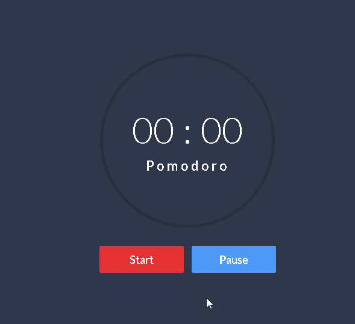

<h1 align="center" ><b>Pomodoro app</b></h1>

<h1>🚀Sobre</h1>
    <h2>Um site com o intuito de mostrar os preços, promoções, e contato,  
       de um restaurante que vende comidas naturais.  </h2>
    
### 📋Features

- [x] Contúdo estilizado
- [x] Responisivo
   
     
### 💻 Technologies Used 
 
 
  
  
  

<h3 align="center"><b> 🖥Preview</b></h3>

    

    
    
<h1 align="center"><a href="https://nelson-dominici.github.io/Loja-landing-page/">Teste você Mesmo</a>
</h1>
    
